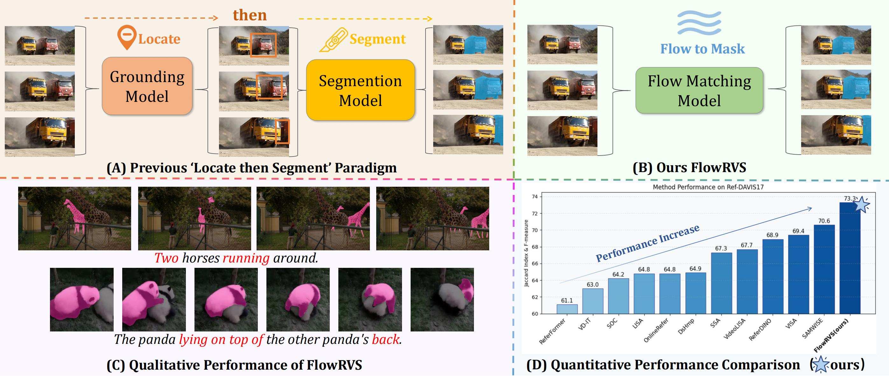
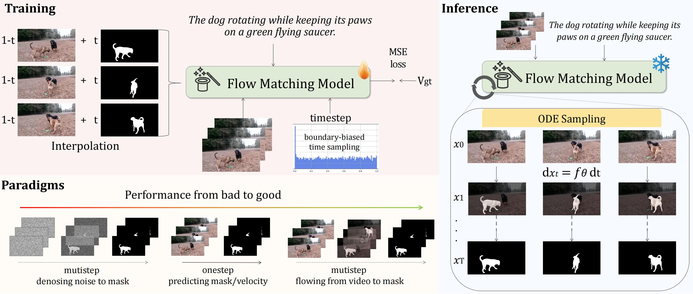

<div align=“center” style=“font-family: charter;”>
<h1 align="center"> Deforming Videos to Masks: Flow Matching for Referring Video Segmentation </h1>

<p align="center">
  <a href='https://arxiv.org/abs/2510.06139'>
    
  </a>
</p>

## 📢 News
[2026.01.26] FlowRVS was accepted by ICLR 2026!  
[2026.02.05] We updated training codes.
[2026.02.13] We updated interesting demos.

## 🏄‍♂️ Overview


<p align="center">
  
  <figcaption style="text-align: center; margin-top: 10px; font-size: 0.95em;">
            <strong>FlowRVS</strong> replaces the cascaded ‘locate-then-segment’ paradigm (A) with a unified, end-to-end flow (B). This new paradigm avoids information bottlenecks, enabling superior handling of complex language and dynamic video (C) and achieving state-of-the-art performance (D).
        </figcaption>
</p>

**✨ Key Features:**

-   **FlowRVS** reformulates RVOS as learning a continuous, text-conditioned flow that deforms a video’s spatio-temporal representation into its target mask.
-   **FlowRVS** successfully  transfer the powerful text-to-video generative model to this RVOS task by proposing a suite of principled techniques.
-   **FlowRVS** achieves  new state of the art (SOTA) results on key benchmarks

<p align="center">
  
</p>


## 🕒 Open-Source Plan
 - [x] Model and Inference Code
 - [x] Model Weight and Inference Guidance 
 - [x] Training Code and Guidance

## 🛠️ Environment Setup

#### 1. Create a conda environment
```
git clone https://github.com/xmz111/FlowRVS.git && cd FlowRVS
conda create -n flowrvs python=3.10 -y
conda activate flowrvs
```
#### 2. Install  dependencies
```
pip install -r requirements.txt
```

#### 3. Prepare Wan2.1 T2V model, we need config to construct models and T5 Encoder.
```
pip install "huggingface_hub[cli]"
huggingface-cli download Wan-AI/Wan2.1-T2V-1.3B-Diffusers --local-dir ./Wan2.1-T2V-1.3B-Diffusers
```


## 🍻 Inference
### Inference on MeViS val and val_u splits.
#### 1. Prepare data
The dataset can be found in: https://github.com/henghuiding/MeViS  
After you successfully download the dataset, the file structure of the dataset should be like this:
* datasets
    * MeViS/
      * valid/
        * JPEGImages/  
        * meta_expressions.json
      * valid_u/
        * JPEGImages/
        * mask_dict.json
        * meta_expressions.json
```
pip install gdown
gdown https://drive.google.com/drive/folders/1MACaQ-O8seyMj-MBlycxRgCT08RVBZJp --folder -O dataset/MeViS/
```
#### 2. Download DiT and tuned VAE checkpoints from  https://huggingface.co/xmz111/FlowRVS  and place them as mevis_dit.pth and tuned_vae.pth;
#### 3.  Inference
Just run:

``` 
CUDA_VISIBLE_DEVICES=0,1 torchrun --nproc_per_node=2 inference_mevis.py --dit_ckpt=FlowRVS_dit_mevis.pth --vae_ckpt=tuned_vae.pth --output_dir=result --split=valid_u
```
   
Note that this code will cost about 33G GPU memory with default setting.

### Inference on any videos.
```
python inference_demo.py --input_path=video.mp4  --text_prompts "prompt_1" "prompt_2"    --fps=12 --save_fig --output_dir=result  --dit_ckpt=FlowRVS_dit_mevis.pth  --vae_ckpt=tuned_vae.pth
```
## 🥂 Training
Use --dataset_file to select training dataset (mevis, pretrain, ytvos), and use --resume to load checkpoint.
```
CUDA_VISIBLE_DEVICES=0,1 torchrun --nproc_per_node=2  main.py  --dataset_file=mevis --num_frames=17 --lr=5e-5 --output_dir=mevis_training 
```

### 🎬 Demos
We provide weights trained exclusively on the challenging MeViS dataset. Despite not seeing these domains during training, FlowRVS demonstrates remarkable zero-shot generalization across movies, sports, and internet memes. Have fun exploring!

<table border="0" align="center">
  <tr>
    <td width="70%" align="center">
      <video src="https://github.com/user-attachments/assets/0cfd289c-e3a0-4a6d-b979-c6023cb78350?raw=true" width="100%" controls="controls" muted="muted"></video>
    </td>
    <td width="30%" valign="top">
       <h3 align="left">🦾 Ultraman</h3>
       <ul>
        <li><b>FPS:</b> 12</li>
        <li><b>Prompt:</b> "the Ultraman", "the devil cat"</li>
        <li><b>Note:</b> Handles complex dynamic interactions (combat) and severe environmental interference (heavy smoke/fog). Observe the fine-grained boundary adherence on the cat's fur and the Ultraman's silhouette despite the chaos.</li>
      </ul>
    </td>
  </tr>
</table>

<br/>

<table align="center">
  <tr>
    <td align="center" width="70%">
      <video src="https://github.com/user-attachments/assets/1d3bd1f3-ded9-4b50-8c43-689b2aac3e90" width="100%" controls="controls"></video>
    </td>
    <td width="30%" valign="top">
       <h3 align="left">🏀⛹️‍♂️ Basketball</h3>
       <ul>
        <li><b>FPS:</b> 12</li>
        <li><b>Prompt:</b> "the man wearing colorful shoes shoots the ball", "the man who is defending", "basketball"</li>
        <li><b>Note:</b> Successfully tracks small, fast-moving objects (the basketball) and articulates complex human motion. It distinguishes the shooter from the defender even during rapid crossover movements.</li>
      </ul>
    </td>
  </tr>
</table>

<br/>

<table align="center">
  <tr>
    <td align="center" width="70%">
      <video src="https://github.com/user-attachments/assets/480d39fb-e378-4733-be3e-a3a47e159875" width="100%" controls="controls"></video>
    </td>
    <td width="30%" valign="top">
      <h3 align="left">⚖️ Better Call Saul</h3>
      <ul>
        <li><b>FPS:</b> 8</li>
        <li><b>Prompt:</b> "angry man in the suit shouting at another man"</li>
        <li><b>Note:</b> Demonstrates robust long-term temporal consistency. The model maintains identity and accurate segmentation over extended sequences, resisting drift even as the camera zooms and subjects interact.</li>
      </ul>
    </td>
  </tr>
</table>

<br/>

<h3 align="center">🐱 Cat Memes Segmentation</h3>

<div align="center">
<table border="0">
<tr>
<td align="center">
<video src="https://github.com/user-attachments/assets/ec3a6d98-b874-4e1a-acee-ab4b3516daa5" height="300" controls="controls" muted="muted"></video>
</td>
<td align="center">
<video src="https://github.com/user-attachments/assets/5a8ec3e0-e78e-41ac-9587-8d55d5f6c238" height="300" controls="controls" muted="muted"></video>
</td>
</tr>
</table>
</div>

<ul>
<li>Robustness against severe occlusions (shelf, paper roll, sausage) and significant non-rigid body deformation. The model tracks the target continuously even when partially hidden or undergoing extreme pose changes.</li>
</ul>

## 💚 Acknowledgement

We referenced the following works, and appreciate their contributions to the community.

- [Wan2.1](https://github.com/Wan-Video/Wan2.1)
- [MeViS](https://github.com/henghuiding/MeViS)


## 🔗 BibTeX
If you find our FlowRVS useful for your research and applications, please kindly cite us:
```
@article{wang2025flowrvs,
  title={Deforming Videos to Masks: Flow Matching for Referring Video Segmentation},
  author={Wang, Zanyi and Jiang, Dengyang and Li, Liuzhuozheng and Dang, Sizhe and Li, Chengzu and Yang, Harry and Dai, Guang and Wang, Mengmeng and Wang, Jingdong},
  journal={arXiv preprint arXiv:2510.06139}, 
  year={2025}
}
```


