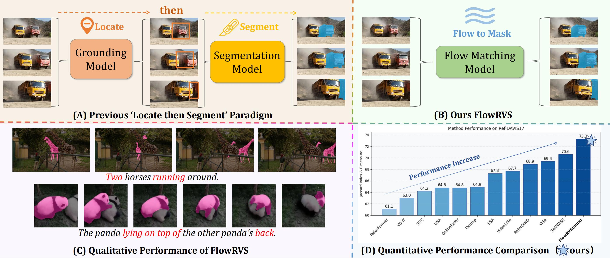

<div align=“center” style=“font-family: charter;”>
<h1 align="center"> Deforming Videos to Masks: Flow Matching for Referring Video Segmentation </h1>

<p align="center">
  <a href='https://arxiv.org/abs/2510.06139'>
    
  </a>
</p>


## 🏄‍♂️ Overview


<p align="center">
  
  <figcaption style="text-align: center; margin-top: 10px; font-size: 0.95em;">
            <strong>FlowRVS</strong> replaces the cascaded ‘locate-then-segment’ paradigm (A) with a unified, end-to-end flow (B). This new paradigm avoids information bottlenecks, enabling superior handling of complex language and dynamic video (C) and achieving state-of-the-art performance (D).
        </figcaption>
</p>

**✨ Key Features:**

-   **FlowRVS** reformulates RVOS as learning a continuous, text-conditioned flow that deforms a video’s spatio-temporal representation into its target mask.
-   **FlowRVS** successfully  transfer the powerful text-to-video generative model to this RVOS task by proposing a suite of principled techniques.
-   **FlowRVS** achieves  new state of the art (SOTA) results on key benchmarks

<p align="center">
  
</p>


## 🕒 Open-Source Plan
 - [x] Model and Inference Code
 - [x] Model Weight and Inference Guidance 
 - [ ] Training Code and Guidance (will be released very soon)

## 🛠️ Environment Setup

#### 1. Create a conda environment
```
git clone https://github.com/xmz111/FlowRVS.git && cd FlowRVS
conda create -n flowrvs python=3.10 -y
conda activate flowrvs
```
#### 2. Install  dependencies
```
pip install -r requirements.txt
```

#### 3. Prepare Wan2.1 T2V model.
```
pip install "huggingface_hub[cli]"
huggingface-cli download Wan-AI/Wan2.1-T2V-1.3B-Diffusers --local-dir ./Wan2.1-T2V-1.3B-Diffusers
```


## 🍻 Inference
Inference on MeViS val and val_u splits.
1. Prepare data:  
* datasets
    * MeViS/
      * valid/
        * JPEGImages/
        * mask_dict.json
        * meta_expressions.json
      * valid_u/
        * JPEGImages/
        * mask_dict.json
        * meta_expressions.json
3. Download DiT and tuned VAE weights and place them as mevis_ckpt.pth and decoder.pth;
4. ``` python inference_mevis.py --dit_ckpt=mevis_ckpt.pth --vae_ckpt=decoder.pth --output_dir=mevis_eval_new --split=valid_u ```
   
This code will cost about 33G GPU memory with default setting.


## 🥂 Training


## 💚 Acknowledgement

We referenced the following works, and appreciate their contributions to the community.

- [Wan2.1](https://github.com/Wan-Video/Wan2.1)


## 🔗 BibTeX
If you find our FlowRVS useful for your research and applications, please kindly cite us:
```
@article{wang2025flowrvs,
  title={Deforming Videos to Masks: Flow Matching for Referring Video Segmentation},
  author={Wang, Zanyi and Jiang, Dengyang and Li, Liuzhuozheng and Dang, Sizhe and Li, Chengzu and Yang, Harry and Dai, Guang and Wang, Mengmeng and Wang, Jingdong},
  journal={arXiv preprint arXiv:2510.06139}, 
  year={2025}
}
```


